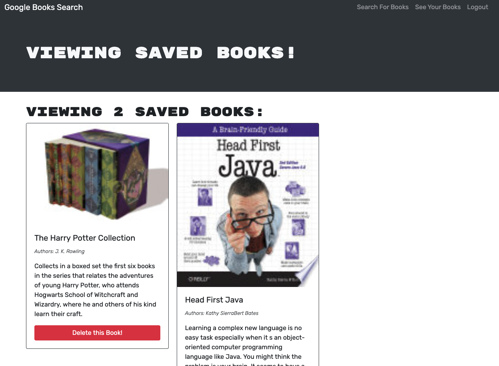
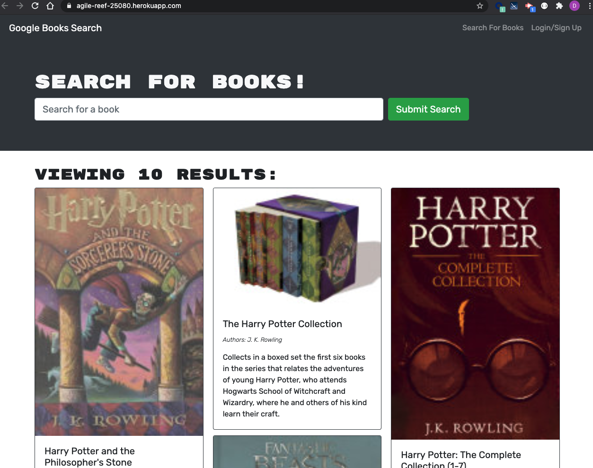

# Book Search

## Description 

This is Book search engine application that allows user create an account and search for books using Google books API. There is also a feature to save/delete favorite books.

## Application Display  

View Application in Heroku - [Here](https://agile-reef-25080.herokuapp.com/)

Preview of Application:

## Tools 

* MongoDB, Mongoose
* Node.js, React, Express.js, Apollo Client
* HTML, CSS, JavaScript

## License

Copyright © 2021 